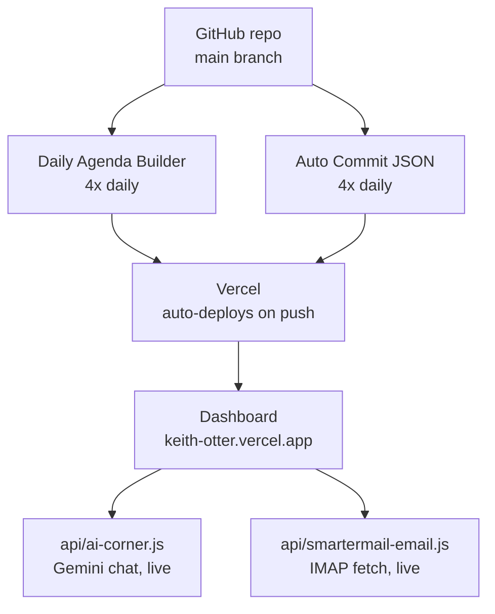

# Keith Dashboard

A personal single-page dashboard for Keith Otter — weather, tasks, live email, news, an AI chat box, a private health hub, and a sleep log. Deployed on Vercel, backed by two scheduled GitHub Actions and two live serverless API endpoints.

**Live:** https://keith-otter.vercel.app

> Note: this repo was forked from `kmo1960-beep/Keith-Otter`, which was originally an n8n/Zapier/ChatGPT automation hub for Fortune's Kitchen and Bar. None of that n8n/Zapier stack is part of this dashboard — it was fully rebuilt as a simpler static-page + Vercel-functions setup. If you see references to n8n, QuickBooks, or a credentials vault anywhere, that's leftover from the fork, not something this project uses.

---

## What's on the dashboard

| Card | Data source | Refresh |
|---|---|---|
| Desert Weather | `output/weather.json` | Written by `Auto Commit JSON` workflow, 4x/day |
| Today's Tasks | Browser localStorage | Instant, on-device only |
| Email Watch | `/api/smartermail-email` | Live IMAP fetch on every page load |
| News Worth Knowing | `scripts/rss_headlines.json` | Written by both scheduled workflows, 4x/day |
| Nighttime | Static links (Audible, Spotify, Podcasts, Otter) | No backend |
| AI Research | `/api/ai-corner` | Live Gemini chat on every question |
| Health Hub | Browser localStorage, PIN-locked | Instant, on-device only |
| Keith's Notes | Browser localStorage | Instant, on-device only |
| Sleep Apnea Recorder | Browser localStorage | Instant, on-device only |

**Everything under "Browser localStorage" never leaves the device** — no backend, no sync between devices/browsers. Health Hub additionally sits behind a PIN screen (also localStorage-based — a screen lock, not encryption).

**Retired but still generated:** `fetch_calendar.py` still runs in the `Daily Agenda Builder` workflow and writes `scripts/calendar_events.json`, and `build_agenda.py` still writes `agenda/daily_agenda.txt` — but neither is read by `index.html` anymore. The dashboard's old Calendar card was replaced by Nighttime, and the old Morning Brief card was removed earlier. Safe to leave running, safe to delete later.

---

## Architecture

Both scheduled workflows write JSON/text files back to the repo, which triggers a Vercel redeploy. The two `/api/` functions are separate — they don't run on a schedule at all, they respond live whenever the dashboard makes a request.

**What each scheduled workflow produces:**

| Workflow | Runs | Scripts | Writes | Actually used by dashboard? |
|---|---|---|---|---|
| Daily Agenda Builder | 4x/day | `fetch_calendar.py`, `fetch_rss.py`, `build_agenda.py` | `scripts/rss_headlines.json`, `scripts/calendar_events.json`, `agenda/daily_agenda.txt` | Only `rss_headlines.json` |
| Auto Commit JSON | 4x/day | `fetch_weather.py`, `fetch_rss.py`, `generate_json.py` | `output/weather.json`, `scripts/rss_headlines.json` | Both |

Both scheduled workflows run at the same four times: **6:30 AM, 11:30 AM, 4:30 PM, 9:30 PM Pacific**. Cron is UTC and does not auto-adjust for daylight saving — the actual local times drift by an hour around the March/November clock changes unless the cron values are manually nudged.

---

## Required secrets & environment variables

**GitHub Actions secrets** (repo → Settings → Secrets and variables → Actions):
| Secret | Used by | Notes |
|---|---|---|
| `GCAL_ICAL_URL` | `fetch_calendar.py` | A calendar's private iCal URL (Google Calendar → calendar settings → "Secret address in iCal format"). Currently unused by the frontend, but the script fails soft (writes an empty file) if this is missing, so it won't break the workflow either way. |

**Vercel environment variables** (Vercel project → Settings → Environment Variables — separate from GitHub secrets above):
| Variable | Used by | Notes |
|---|---|---|
| `SMARTERMAIL_USER` | `api/smartermail-email.js` | SmarterMail inbox username |
| `SMARTERMAIL_PASS` | `api/smartermail-email.js` | SmarterMail inbox password |
| `GEMINI_API_KEY` | `api/ai-corner.js` | Google AI Studio key. Current model: `gemini-3.6-flash` (free tier). Google has retired Flash model names before without much notice — if AI Research starts returning `"source": "fallback"`, check `ai.google.dev/gemini-api/docs/pricing` for the current free-tier model name and swap the `MODEL` constant in `api/ai-corner.js`. |

---

## Known quirks worth knowing about

- **Duplicate Vercel project**: `keith-otter-z6yq` is a second Production deployment that builds from the same repo alongside the real one. It's missing the SmarterMail env vars, so it always shows "SmarterMail not configured" — easy to mistake for a bug if you land on it by accident. Safe to delete in Vercel project settings; the real site is `keith-otter.vercel.app`.
- **GitHub Action email notifications**: with two workflows now running 4x/day each, failed-run emails can flood an inbox fast. Turn off email notifications for Actions at github.com/settings/notifications (or scope it per-repo via the repo's "Watch" dropdown → Custom → uncheck Actions).
- **Email Watch priority list**: only senders matching the `priorityFrom` list in `api/smartermail-email.js` are shown — everything else is filtered out. Ranking is by recency *within* that list, not priority-first, so a new priority email always beats an old one.

---

*La Quinta, CA*
